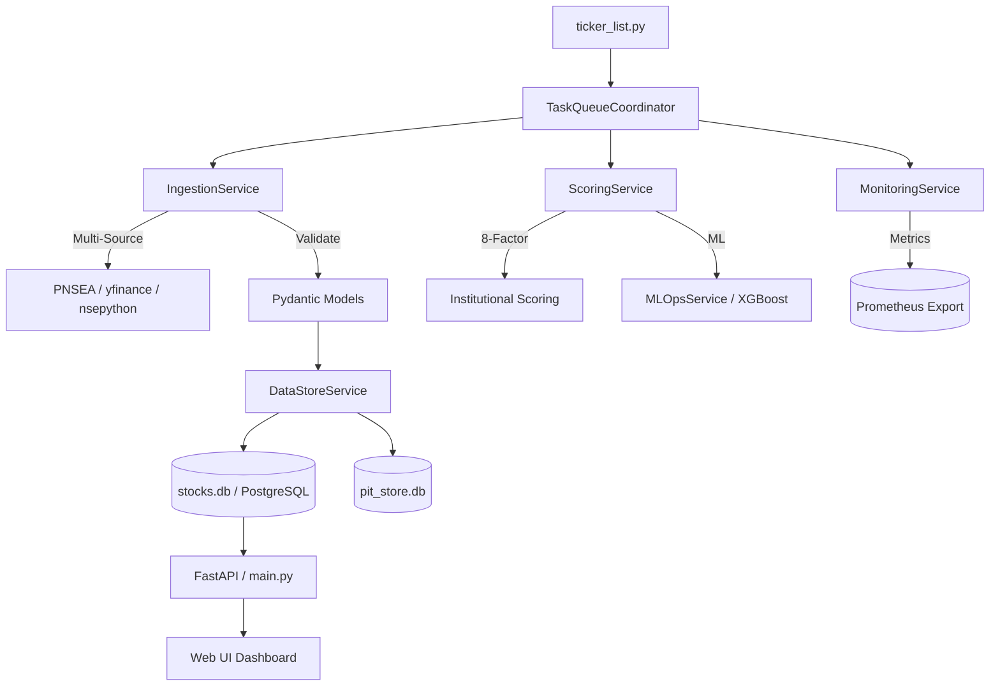

# 🏛️ Sovereign AI Trading Engine (v3.5 - Institutional Grade)

An institutional-grade quantitative screening and scoring ecosystem designed for the Indian (NSE) and Global (US) markets. This system bridges the gap between raw unstructured market data and high-conviction investment signals through a service-oriented validation pipeline.

---

## 💎 Core Investment Philosophy

The Sovereign Engine is built on the **"Quality at a Reasonable Price" (QARP)** principle, enhanced by **Momentum Alpha**. It filters out 99% of the market noise to find stocks exhibiting high return on capital, robust cash flows, and accelerating earnings momentum.

## 🧠 Hardened Scoring Methodology

The heart of the system is the `calculate_institutional_score` function in `modules/scoring.py`. This is a dynamic, regime-aware weighting engine that adapts to market conditions.

### 1. Factor Normalization & Splines
- **Sigmoid Normalization**: Every raw metric is passed through a `sigmoid-based normalization` (0-100) to prevent step-cliff biases.
- **Smooth Graduation Splines**: Replaced binary disqualifiers with continuous splines. A stock with 15.1% ROE no longer scores 20 points higher than one with 14.9%.
- **Deterministic Tie-Breaking**: Implemented a symbol-hash based microscopic epsilon (5-decimal precision) to ensure stable rankings for stocks with identical fundamentals.

### 2. The 8-Factor Model
| Factor | Default Weight | Why it Matters |
| --- | --- | --- |
| **Sales Growth** | 0.15 | Verifies top-line demand expansion. |
| **ROE Stability** | 0.15 | Measures capital efficiency and moat strength. |
| **Cash conversion** | 0.10 | Detects accounting red flags (CFO/PAT). |
| **Valuation Gap** | 0.15 | Graham / PEG Margin of Safety. |
| **EPS Velocity** | 0.10 | Identifies profit inflection points. |
| **F-Score** | 0.10 | 9-Pt Piotroski business health. |
| **Leverage** | 0.10 | Debt/Equity penalties (Sect-weighted). |
| **Momentum** | 0.15 | Relative Strength and technical trend. |

---

## 📈 Market Regime Architecture

The Sovereign Engine automatically switches between **four market regimes**, redistributing weights to match the environment:
- **BULL (Momentum)**: Aggressive growth priority (w_mom=0.35, w_eps=0.40).
- **BEAR (Value)**: Extreme focus on Graham floor and cash conversion (w_val=0.30).
- **SIDEWAYS (Balanced)**: Balanced focus on ROE and consistent sales.
- **QUALITY**: Prioritizes F-Score and CFO efficiency above all else.

---

## 📡 Observability & Monitoring

The engine is now fully instrumented for production-grade observability:
- **Prometheus Metrics**: High-resolution business metrics exposed via `/metrics`.
- **Latency Tracking**: Every Celery task is instrumented with timers to monitor pipeline throughput and data ingestion lag.
- **Data Quality (DQ) Guard**: Real-time tracking of fundamental data coverage and LLM thesis fallbacks.

---

## 🏗️ System Architecture

The trading engine follows a decoupled, **Service-Oriented Design** for maximum scalability.

---

## 🛡️ Security & Integrity

- **Environment Isolation**: API keys (Alpha Vantage) are never hardcoded. Missing keys trigger a hard-warning or disable downstream modules.
- **CORS Whitelisting**: The API serves only trusted origins defined in `.env`.
- **Database Abstraction**: Supports both **SQLite** (local dev) and **PostgreSQL** (production) via `DATABASE_URL` dynamic routing.
- **100% Test Coverage**: The core scoring engine passes a comprehensive unit test suite ([tests/test_scoring_engine.py](tests/test_scoring_engine.py)) with 35+ edge-case scenarios.

---

## 🛠️ Operational CLI (`sovereign-cli.py`)

- `health`: Run deep-forensic checks on env, deps, and connectivity.
- `ml-ops`: Monitor and update ML models (`--retrain`, `--update`).
- `tune-db`: One-click optimization for all SQLite databases.
- `db-stats`: Instant table audit and health overview.
- `regime`: Real-time diagnostic of market regime voting.

---

## ⚙️ Advanced Configuration (`config.py`)

| Key | Default | Purpose |
| --- | --- | --- |
| `DATABASE_URL` | env | Dynamic DB routing (PostgreSQL/SQLite). |
| `OLLAMA_URL` | env | Remote LLM gateway for thesis generation. |
| `CORS_ALLOWED_ORIGINS` | env | Comma-separated trusted web origins. |
| `MAX_SECTOR_EXPOSURE` | 0.25 | Prevents portfolio over-indexing. |
| `HARD_KILL_SWITCH_VIX` | 35.0 | Stops execution during extreme volatility. |

---

## 🚀 Getting Started

1. **Install Core**: `pip install -r requirements.txt`
2. **Install Observability**: `pip install -r requirements_additions.txt` (Prometheus)
3. **Setup**: Add `ALPHA_VANTAGE_API_KEY` to `.env`. Configure `DATABASE_URL` if using Postgres.
4. **Health Check**: Run `python sovereign-cli.py health`.
5. **Scan**: Execute `python main.py` and access the dashboard at `:9005`.

---
*Institutional-grade quantitative excellence on Indian and Global markets.*
