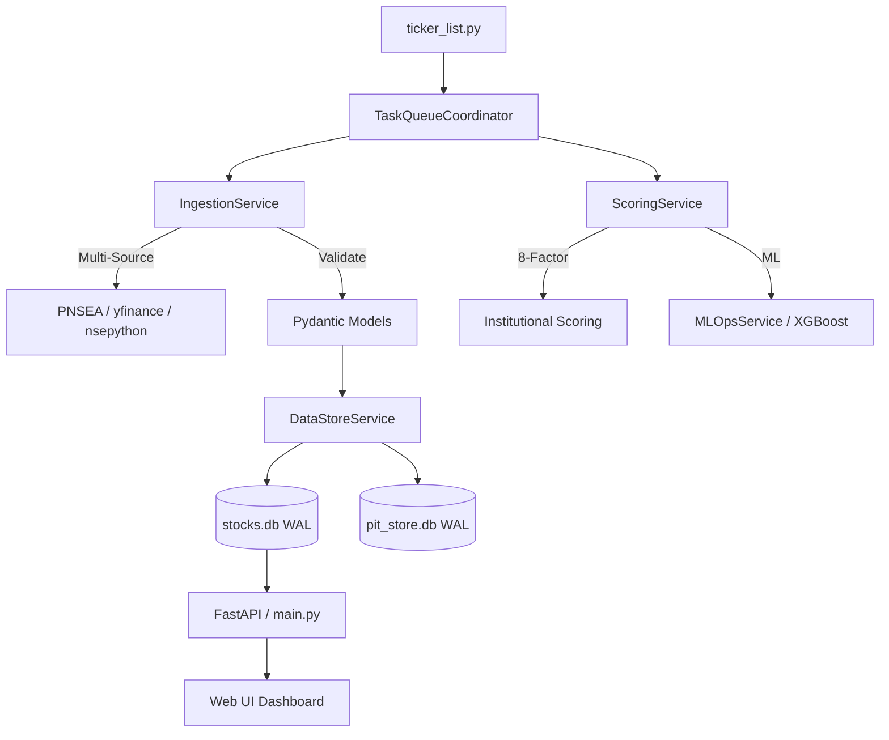

# 🏛️ Sovereign AI Trading Engine (v3.5)

An institutional-grade quantitative screening and scoring ecosystem designed for the Indian (NSE) and Global (US) markets. This system bridges the gap between raw unstructured market data and high-conviction investment signals through a service-oriented validation pipeline.

---

## 💎 Core Investment Philosophy

The Sovereign Engine is built on the **"Quality at a Reasonable Price" (QARP)** principle, enhanced by **Momentum Alpha**. It filters out 99% of the market noise to find stocks exhibiting high return on capital, robust cash flows, and accelerating earnings momentum.

## 🧠 Advanced Scoring Methodology

The heart of the system is the `calculate_institutional_score` function in `modules/scoring.py`. This is a dynamic, regime-aware weighting engine that adapts to market conditions.

### 1. Factor Normalization
Every raw metric is passed through a `sigmoid-based normalization` (0-100) using sector-specific or absolute anchors to prevent step-cliff biases.

### 2. The 8-Factor Model
| Factor | Source | Why it Matters |
| --- | --- | --- |
| **Sales Growth** | TTM / 5Y CAGR | Verifies top-line demand expansion. |
| **ROE Stability** | 5Y Avg / TTM | Measures capital efficiency and moat strength. |
| **Cash conversion** | CFO / PAT | Detects accounting red flags or accrual-heavy earnings. |
| **Valuation Gap** | Graham / PEG | Prevents overpaying for growth (Safety Margin). |
| **EPS Velocity** | TTM Growth | Identifies the inflection point in profitability. |
| **F-Score** | 9-Pt Piotroski | Measures overall balance sheet health improvement. |
| **Leverage** | Debt/Equity | Penalized fragile capital structures (Sect-weighted). |
| **RS Momentum** | Relative Strength | Ensures we are surfing the trend, not fighting it. |

### 3. Machine Learning Alpha (Automated)
The engine incorporates a **XGBoost Meta-Model** that predicts forward returns based on historical factor signatures.
- **Automated ML Ops**: The system automatically monitors record growth in `fundamentals_pit` and triggers retraining via `sovereign-cli.py ml-ops`.
- **SHAP Explainability**: Every ML prediction includes a feature-lvl breakdown of WHY the model is bullish or bearish.

---

## 📊 Market Regime Architecture

The Sovereign Engine automatically switches between **four market regimes**, redistributing the 8 weights to match the environment.

- **BULL (Momentum)**: High aggressive growth, rewards breakouts.
- **BEAR (Value)**: Extreme focus on Graham floor and cash conversion.
- **SIDEWAYS (Balanced)**: Focus on ROE and consistent sales.
- **QUALITY**: Focuses on F-Score and CFO efficiency above all else.

---

## 🛡️ Data Quality & High-Performance Persistence

We treat data quality as a first-class citizen using strict contracts and optimized storage.

### 1. Pydantic Data Contracts
All data flowing through the services is validated against regular schemas in `modules/models.py`. This prevents "NoneType" crashes and ensures type safety (e.g., ROE is always a float).

### 2. Tiered Caching (`DataStoreService`)
The engine utilizes a high-speed caching strategy:
- **L1 (Memory)**: Instant access for active scan sessions.
- **L2 (SQLite WAL-Mode)**: Persistent cross-run cache in `data_cache.db` with Write-Ahead-Logging for high concurrency.

### 3. Pipeline Hardening
Generic tracebacks have been replaced with a customized exception hierarchy, allowing the orchestrator to gracefully log errors without crashing the entire scan parallel pool.

---

## 🏗️ System Architecture

The trading engine follows a decoupled, **Service-Oriented Design** for maximum scalability.

### Core Services
- **TaskQueueCoordinator**: Orchestrates large universe scans using asynchronous batching.
- **IngestionService**: Manages complex data fetching with built-in fallbacks.
- **ScoringService**: Encapsulates all quantitative and ML scoring logic.
- **MLOpsService**: Automates the model training/update lifecycle.

---

## 🛠️ Operational CLI (`sovereign-cli.py`)

Manage the entire engine from a unified command-line tool.

- `health`: Run deep-forensic checks on env, deps, and connectivity.
- `ml-ops`: Monitor and update ML models (`--retrain`, `--update`).
- `tune-db`: One-click optimization for all SQLite databases.
- `db-stats`: Instant table audit and health overview.
- `regime`: Real-time diagnostic of market regime voting.
- `dups`: Identify and forensic audit for duplicate records.

---

## ⚙️ Advanced Configuration (`config.py`)

Critical production knobs:
- `MAX_SECTOR_EXPOSURE` (0.25): Prevents portfolio over-indexing.
- `HARD_KILL_SWITCH_VIX` (35.0): Stops buying during extreme volatility.
- `MIN_DATA_QUALITY` (50): Minimum bar for fundamental consideration.
- `FULL_SCAN_BASE_CONCURRENCY` (12): Tuning for network throughput.

---

## 🚀 Getting Started

1. **Install**: `pip install -r requirements.txt`
2. **Setup**: Add `ALPHA_VANTAGE_API_KEY` to `.env`.
3. **Initialize**: Run `python sovereign-cli.py tune-db` to optimize your disks.
4. **Health Check**: Run `python sovereign-cli.py health`.
5. **Scan**: Execute `python main.py` or use the CLI modules for targeted tasks.

---
*Built for quantitative excellence on Indian and Global markets.*
